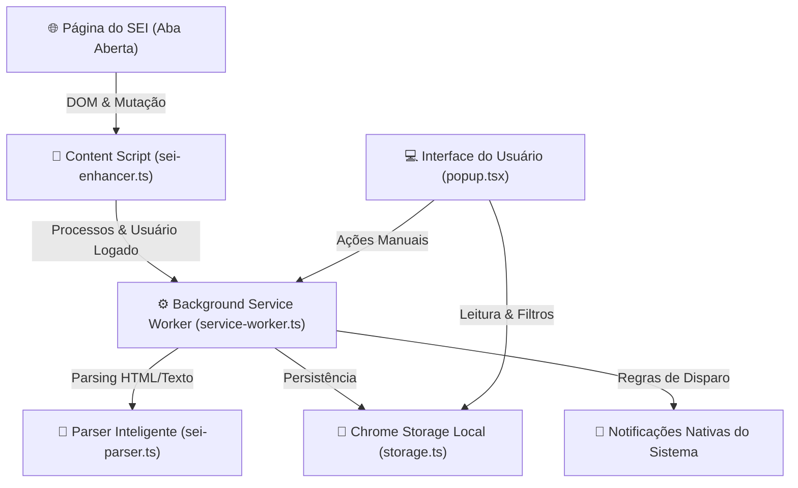

# 📘 Tutorial Completo do CRM-SEI (SEI! Radar)

O **CRM-SEI** (ou **SEI! Radar**) é uma extensão de navegador leve, moderna e segura, desenvolvida para servidores e colaboradores que utilizam o **Sistema Eletrônico de Informações (SEI)**. 

Ela monitora sua caixa de processos da unidade em segundo plano, extrai automaticamente assuntos, atribuições e marcadores, e envia notificações nativas na sua área de trabalho sempre que surgirem novos processos de seu interesse.

---

## 📑 Sumário

1. [O que a Extensão Faz](#-o-que-a-extensão-faz)
2. [Instalação Passo a Passo](#-instalação-passo-a-passo)
3. [Como Funciona por Baixo dos Panos](#-como-funciona-por-baixo-dos-panos)
4. [Guia de Uso Prático](#-guia-de-uso-prático)
5. [Configurações e Regras de Notificação](#-configurações-e-regras-de-notificação)
6. [Segurança e Privacidade](#-segurança-e-privacidade)
7. [Perguntas Frequentes (FAQ)](#-perguntas-frequentes-faq)

---

## 🎯 O que a Extensão Faz

- **🔔 Notificações Nativas no Desktop**: Exibe alertas no canto da tela (Windows/Linux/macOS) informando número do processo, assunto, atribuição e marcadores.
- **⚠️ Alerta de Conexão e Sessão**: Exibe `OFF` no ícone da extensão e um banner no popup quando sua sessão no SEI expirar ou o sistema estiver instável. A notificação no desktop para esse caso é **opcional e vem desligada**, justamente para não avisar de novo a cada verificação — ligue em *Configurações → Avisar quando a sessão do SEI cair* se preferir ser notificado.
- **🤫 Carga Inicial Silenciosa (Anti-Spam)**: Ao abrir o SEI pela primeira vez, ela registra todos os processos já existentes na sua unidade sem inundar seu computador com dezenas de notificações. Apenas processos que chegarem depois disso dispararão alertas.
- **👤 Filtro "Atribuídos a Mim"**: Identifica automaticamente sua sigla/usuário no SEI (ou permite configurá-la) e separa com 1 clique apenas os processos destinados a você.
- **🏷️ Filtro por Marcadores**: Detecta todas as tags/marcadores criados no SEI (`Urgente`, `Licitação`, `Análise Jurídica`, etc.) e cria chips de filtros rápidos para visualização instantânea.
- **⚙️ Regras de Notificação Customizáveis**: Permite escolher se deseja receber notificações de:
  - *Todos os processos da unidade*;
  - *Apenas os atribuídos a você*;
  - *Atribuídos a você OU com determinados marcadores de seu interesse*.
- **🔍 Busca Instantânea**: Pesquise na hora por número de processo, trechos do assunto, sigla de atribuição ou nome do marcador.
- **🔢 Badge Contador no Ícone**: Exibe um contador visual de processos não lidos no ícone da barra de ferramentas (e `OFF`/`!` se desconectado).
- **📂 Abertura Direta**: Um clique no card ou na notificação leva você direto para o processo na página do SEI.

---

## 🚀 Instalação Passo a Passo

### Pré-requisitos
- Navegador baseado em Chromium: **Google Chrome**, **Microsoft Edge**, **Brave**, **Opera**, etc.
- Acesso à internet e login regular no SEI do seu órgão (ex: SEI!MG, SEI Federal, etc.).

---

### Opção 1: Compilando a partir do Código-Fonte (Desenvolvedores)

1. No terminal do projeto, instale as dependências e faça o build:
   ```bash
   npm install
   npm run build
   ```
2. O comando criará a pasta `dist/` com todos os arquivos prontos e empacotados.

---

### Opção 2: Carregando a Extensão no Navegador

1. Abra o navegador de sua preferência e acesse a página de extensões:
   - **Google Chrome / Brave**: digite `chrome://extensions` na barra de endereços e aperte Enter.
   - **Microsoft Edge**: digite `edge://extensions` na barra de endereços.
2. No canto superior direito, **ative a chave "Modo do desenvolvedor"** (*Developer mode*).
3. No canto superior esquerdo, clique no botão **"Carregar sem compactação"** (*Load unpacked*).
4. Navegue até a pasta do projeto e selecione a pasta **`dist`**.
5. A extensão **CRM-SEI (SEI! Radar)** aparecerá imediatamente na sua lista de extensões ativas.

---

### 📌 Fixando na Barra de Ferramentas

Para acompanhar facilmente os alertas e o contador de processos:
1. Clique no ícone de quebra-cabeça 🧩 (menu de Extensões) ao lado da barra de URL do navegador.
2. Localize **SEI! Radar** e clique no ícone de **Alfinete 📌** (Fixar).
3. O ícone azul do SEI ficará sempre visível no navegador.

---

## ⚙️ Como Funciona por Baixo dos Panos

A arquitetura da extensão foi projetada de forma modular e otimizada para o padrão **Manifest V3**:



### 1. Injeção e Monitoramento no DOM (`content/sei-enhancer.ts`)
- Quando você navega no SEI, o content script monitora a tabela de controle (`tblProcessosRecebidos`, `tblProcessosGerados`).
- Utiliza um `MutationObserver` para detectar alterações imediatas (como paginação ou atualizações na tela do SEI) e envia os dados ao service worker.

### 2. Checagem em Segundo Plano (`background/service-worker.ts`)
- Configura um alarme do navegador (`chrome.alarms`) que executa a cada intervalo determinado (padrão: 5 minutos).
- **Abordagem Inteligente**:
  1. Primeiro verifica se já existe alguma aba do SEI aberta. Em caso afirmativo, consulta o DOM dessa aba sem fazer requisições extras ao servidor, evitando conflito de sessão.
  2. Se não houver abas abertas, faz uma requisição HTTP `fetch` autenticada usando os cookies seguros da sua sessão ativa no SEI.

### 3. Extração e Limpeza de Dados (`shared/sei-parser.ts`)
- Faz o parsing do HTML procurando:
  - **Número do Processo**: Validação rigorosa por regex com suporte a múltiplos formatos de numeração.
  - **Assunto/Especificação**: Extrai do atributo `title`, células de especificação ou tooltips JavaScript (`infraTooltipMostrar`), removendo prefixos redundantes.
  - **Atribuição**: Captura o usuário atribuído a partir de links `ancoraSigla` e tooltips `Processo atribuído para...`.
  - **Marcadores**: Detecta ícones e links de marcadores/etiquetas anexados à linha.
  - **Usuário Logado**: Lê `#lblUsuario` ou `a#ancoraUsuario` no topo da página para saber qual a sua sigla.

### 4. Armazenamento e Estado (`shared/storage.ts`)
- Armazena as configurações e o histórico no `chrome.storage.local`.
- Nenhuma informação é trafegada para a internet ou para servidores terceiros.

---

## 🖥️ Guia de Uso Prático

### 1. Visualizando seus Processos
Ao clicar no ícone da extensão na barra de ferramentas:
- **Barra de Status**: Informa se você está `Conectado ao SEI`, `Verificando...` ou se precisa `Fazer login no SEI`.
- **Filtros Rápidos no Topo**:
  - **Todos**: Mostra todos os processos da unidade.
  - **Atribuídos a Mim**: Filtra instantaneamente apenas os processos onde você é o responsável.
  - **Novos**: Mostra apenas processos que ainda não foram marcados como lidos.
- **Barra de Marcadores (Chips)**: Se existirem marcadores na unidade (ex: `Urgente`, `Pagamento`), clique sobre o chip correspondente para filtrar a lista.

### 2. Gerenciando Leitura
- Cada card de processo exibe uma tarja lateral azul e o selo `NOVO` enquanto não for lido.
- Clique no botão **"Marcar lido"** em um card para retirá-lo da lista de novidades.
- Ou clique em **"Marcar todos lidos"** no topo para limpar os alertas pendentes.

### 3. Abrindo Processos
- Clique em qualquer parte do card ou no link com o número do processo para abri-lo diretamente em uma nova aba do SEI.

---

## 🎛️ Configurações e Regras de Notificação

Clique no ícone de **engrenagem ⚙️** no canto superior direito do popup para acessar as opções:

| Opção | Descrição |
| :--- | :--- |
| **Minha Sigla / Usuário no SEI** | Sua identificação no SEI (ex: `MG123456` ou `MARCO.GUERRA`). É detectada automaticamente ao abrir o SEI, mas você pode editá-la quando desejar. |
| **Regra de Notificações** | • **Todos os novos processos**: Avisa tudo o que entrar na unidade.<br>• **Apenas atribuídos a mim**: Avisa apenas quando um novo processo for atribuído a você.<br>• **Atribuídos a mim OU com marcadores**: Avisa se for para você ou se tiver alguma das tags que você marcar. |
| **Marcadores para Notificar** | Quando selecionada a regra mista, permite escolher quais marcadores (ex: `Urgente`) devem acionar alertas. |
| **Intervalo de Verificação** | Define a frequência de checagem automática (1, 2, 5, 10 ou 15 minutos). |
| **Notificações no Sistema** | Ativa ou silencia os popups nativos de notificação na área de trabalho. |
| **Radar Sonoro** | Ativa ou desativa o aviso sonoro discreto ao receber processos. |
| **Avisar quando a sessão do SEI cair** | Desligado por padrão. Ligue para receber uma notificação no desktop quando sua sessão expirar. O aviso sai **uma vez por queda**, e não se repete enquanto você continuar deslogado. Mesmo desligado, o `OFF` no ícone e o banner dentro do Radar continuam sinalizando. |
| **Testar Notificação** | Dispara uma notificação de demonstração para testar som e visualização no seu sistema operacional. |

---

## 🔒 Segurança e Privacidade

- 🛡️ **Execução 100% Local**: Todo o processamento ocorre exclusivamente dentro do seu navegador.
- 🚫 **Sem Servidores Externos**: A extensão não envia métricas, processos, senhas ou dados para nenhum servidor na nuvem.
- 👁️ **Somente Leitura**: A extensão não possui funções para criar, alterar, assinar ou excluir documentos no SEI.
- 🔐 **Sessão Segura**: Não armazena sua senha; ela utiliza apenas a sessão ativa que você já iniciou no seu navegador.

---

## ❓ Perguntas Frequentes (FAQ)

### 1. A extensão funciona se eu fechar o SEI?
Sim! Desde que o navegador (Chrome/Edge) esteja aberto e sua sessão no SEI continue válida, o serviço em segundo plano continuará verificando os processos no intervalo programado. Se a sessão expirar, basta fazer login novamente.

### 2. Por que a primeira carga não disparou notificações?
Foi projetado exatamente para o seu conforto! Na primeira vez que a extensão lê o SEI, ela salva o histórico existente silenciosamente para evitar que você receba dezenas de alertas antigos de uma só vez. As notificações soarão apenas para os próximos processos que chegarem.

### 3. A extensão não está emitindo som ou popups na tela. O que conferir?
- Verifique se o modo **"Não Perturbe"** ou **"Assistente de Foco"** do seu Windows/Linux está ativado.
- Verifique nas configurações do seu navegador se as notificações estão autorizadas para o Chrome/Edge.
- Abra o painel de configurações (⚙️) da extensão e clique no botão **"Testar Notificação de Exemplo"**.

---

*CRM-SEI — Produtividade e agilidade no acompanhamento dos seus processos eletrônicos.*
